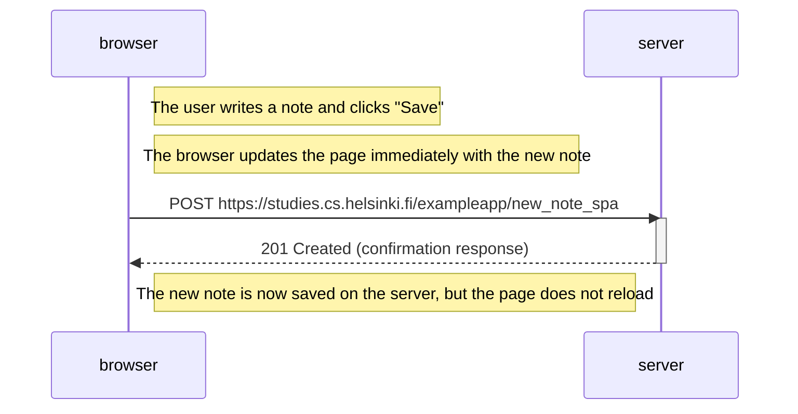

```mermaid
sequenceDiagram
    participant browser
    participant server

    Note right of browser: The user writes a note and clicks "Save"

    Note right of browser: The browser updates the page immediately with the new note 

    browser->>server: POST https://studies.cs.helsinki.fi/exampleapp/new_note_spa
    activate server
    server-->>browser: 201 Created (confirmation response)
    deactivate server

    Note right of browser: The new note is now saved on the server, but the page does not reload


```